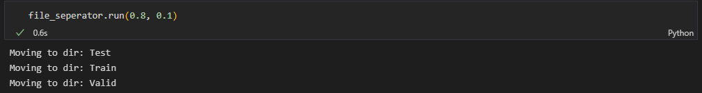
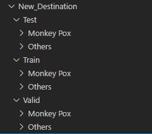

# File Seperator
This python class allows for automatic segragation of classes of image files into train, test and validation directories, after which they can be fed into tf.data pipelines.

## Requirements
  - python 3.8.0 or above
  - python random library
  - python pathlib library
  - python shutil library
  - python os library

**One of the major requirements for the file seperator to work correctly is that the image files should be seperated by class in their directory.**

## Files
There is a single file - FileSeperator.ipynb. This is a jupyter notebook which contains two cells, the first one imports the libraries required and the second cell contains the code for the FileSeperator class.

## Using the File Seperator
The FileSeperator can be instantiated just as any other class in python, it requires two arguments to instantiate:

### Parameters
- `main_path` - This variable represents the target path of the overall data - the seperator will create train, test, and validation files for each class contained in the original dataset. This is a string variable.
- `original_dir` - This is the location of the directory containing the images belonging to different classes. This is a string variable.

### Methods
*Most of the methods present in the seperator class are for the internal workings of the class and need not be called. Below are two of the methods a user of the class may call.*

- `run` - This method is used for using the seperator, after successfully instantiating with the file paths, calling the run function will split the class files amongst train, test, and validation datasets.
   #### Arguments
   - `train_pr` - This is a float variable, represents the proportion of training data. Must be a number `> 0 & < 1`.
     - For example - `0.7` for a 70% train split.
   - `valid_pr ` - This is a float variable, represents the proportion of validation data. Must be less than `train_pr`, sum of `train_pr` and `valid_pr` must `< 1`.
     - For example - `0.15` for a 15% validation split.
   - *Note the test proportion is calculated automatically.*
 - `print_statistics` - This method can be used to display a final count in all the sub directories, the user may sum them to confirm that no file has been lost or repeated. This method takes no arguments.
 - `test_proportions` - This method can be used to test the training and validation proportions before running the `run` function.
    #### Arguments
   - `train_pr` - This is a float variable, represents the proportion of training data. Must be a number `> 0 & < 1`.
     - For example - `0.7` for a 70% train split.
   - `valid_pr ` - This is a float variable, represents the proportion of validation data. Must be less than `train_pr`, sum of `train_pr` and `valid_pr` must `< 1`.
     - For example - `0.15` for a 15% validation split.
   - *Note the test proportion is calculated automatically.*

    #### Returns
    This function does not return any output. It does print a message indicating whether the proportions enterred are incorrect, and provides reasons as to why that has occurred.

## Examples
The following code snippets and images serve as an illustration to demonstrate the capabilities of the file seperator.

   1. The original directory is in the following format. Dir>Class1,Class2. Original Images is the directory containing all the images of the dataset, the images are seperated by class.

        
   
   2. The following code snippet instantiates the FileSeperator object. Where `./New_Destination/` is the name of the target directory, and `./Original Images/` is the name of the directory containing the image files.

    file_seperator = FileSeperator("./New_Destination/", "./Original Images/")

  3. The following code snippet calls the `test_proportion` with various different inputs to test which pair of inputs are valid and the output recieved.

    file_seperator.test_proportions(0.1, 0)
    file_seperator.test_proportions(0.5, 0.5)
    file_seperator.test_proportions(0.8, -0.1)
    file_seperator.test_proportions(0.8, 0.1)

    The validation proportion is not valid. Please enter a value greater than 0 and less than 1.
    The sum of the validation and training proportion is greater than or equal to one, this is not valid. Please enter values such that their sum is strictly less than 1.
    The validation proportion is not valid. Please enter a value greater than 0 and less than 1.
    The proportions enterred are valid.

  4. The following image displays the `run` method being used with the correct proportions displayed in the point above. The final split will be 80-10-10. The first image shows the output to calling the `run` method. The second image displays the final arrangement of the files.

  5. The following code snippet displays the output of the `print_statistics` method. This method prints out the number of files in each directory and sub directory.
    
    file_seperator.print_statistics()

    Files in Test -> Monkey Pox Directory : 11
    Files in Test -> Others Directory : 13
 
    Files in Train -> Monkey Pox Directory : 81
    Files in Train -> Others Directory : 100
 
    Files in Valid -> Monkey Pox Directory : 10
    Files in Valid -> Others Directory : 12

*Note: The FileSeperator copies files from their original location to the target directory, if a directory has many files, this operation can take quite a lot of time.*

## Why Should you use the FileSeperator
- The `FileSeperator` can enable you to split directories of images into train, test and validation datasets which can be fed into tf.data pipelines accelarting the machine learning process.
- Many datasets often provide a split of the data, however it may not be in the proportion one may want it to be in, in this case, the `FileSeperator` allows a user to set their own proportions for the train-test-validation split.

## Disclaimer
Wherever mentioned, the images may not be available, due to this the user may view files fs_1, fs_2, and fs_3. They are in the order in which they are mentioned.

    

